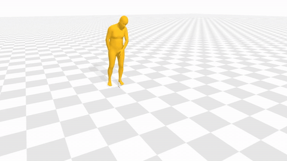
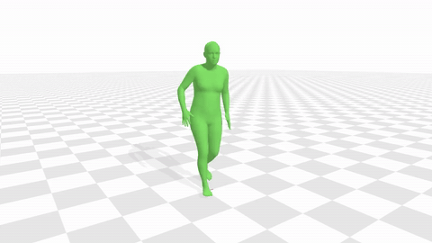
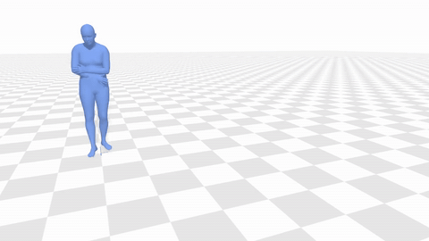
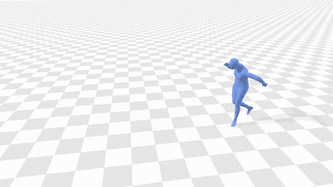
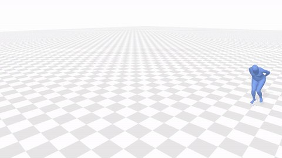
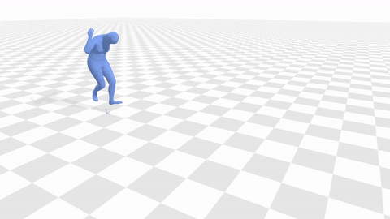

# VISTA: Video-Injected Stylized Text-to-Animation

[](https://arxiv.org/abs/2609.23817)
[](https://arxiv.org/abs/2609.23817)

Official implementation of **VISTA: Video-Injected Stylized Text-to-Animation**
(Multimodal Human Motion Analysis Workshop (MOMA) at CVPR 2026).

Monseej Purkayastha<sup>1</sup>, Anindita Ghosh<sup>1,2</sup>, and Philipp Slusallek<sup>1</sup>

<sup>1</sup>Saarland Informatics Campus & German Research Centre for Artificial Intelligence (DFKI), Saarbrücken, Germany
<sup>2</sup>Max Planck Institute for Informatics (MPII), Saarbrücken, Germany

<table>
  <tr>
    <td colspan="3" align="center"><i>"A person kicks with his right leg, while walking forward."</i> + <b>ArmsFolded</b> style video</td>
  </tr>
  <tr>
    <td align="center" width="33%"><br>LoRA-MDM</td>
    <td align="center" width="33%"><br>SMooDi</td>
    <td align="center" width="33%"><br><b>VISTA</b></td>
  </tr>
  <tr>
    <td colspan="3" align="center"><i>"A person runs forward, then crouches down."</i> (VISTA)</td>
  </tr>
  <tr>
    <td align="center" width="33%"><br>ArmsFolded</td>
    <td align="center" width="33%"><br>Chicken</td>
    <td align="center" width="33%"><br>Robot</td>
  </tr>
</table>

<sub>Playback slowed down 1.5×. MP4 versions in <a href="assets/videos">assets/videos</a>.</sub>

> We present VISTA, a two-stage framework for generating stylized 3D human motion by fusing structural content from text prompts with expressive style from reference videos, without requiring jointly paired (text, video, stylized motion) triplets. A Dual-channel Autoencoder first maps motion sequences and video clips into a shared latent manifold. A masked autoregressive diffusion backbone then operates within this manifold, injecting video-derived style through a dedicated late-fusion Dual-AdaLN pathway while preserving text-conditioned content structure. A cross-batch unpaired training protocol with latent cycle consistency enables joint learning across separate semantically rich and stylistically diverse datasets. As a proof-of-concept for controllable animation synthesis, we validate VISTA on rendered motion-capture references: it achieves the highest style recognition accuracy among video-conditioned methods while preserving competitive content alignment, and its decomposed 3-way classifier-free guidance provides independent, user-controllable calibration of the content–style balance at inference time.

## Installation

```bash
conda env create -f environment.yml
conda activate vista
```

or with pip in a Python 3.10 environment:

```bash
# PyTorch (CUDA 12.6)
pip install torch==2.8.0 torchvision==0.23.0 --index-url https://download.pytorch.org/whl/cu126

pip install -r requirements.txt          # requirements-lock.txt: exact tested package set
```

`ffmpeg` and `git` must be on `PATH`. ViViT (`google/vivit-b-16x2-kinetics400`) and CLIP ViT-B/32 are
downloaded automatically on first use. On Windows, data loading runs in the main process by default
(`--num_workers 0`).

## Checkpoints

Download the checkpoints from
[Google Drive](https://drive.google.com/drive/folders/GDRIVE_FOLDER_ID)
and place them in the repository root so that the layout below is matched (or keep them elsewhere and
symlink `checkpoints/`, `glove/` and `body_models/` into the repository).

```text
checkpoints/
├── t2m/
│   ├── MARDM-DDPM-XL/model/
│   │   ├── final_diffmlp_diff_v4_cfg_cross_batch_hybrid_ema_fix.tar           # VISTA (sampling + evaluation)
│   │   └── humanml3d_latest.tar                                               # pretrained MARDM (training init)
│   ├── AE/model/latest.tar                                                    # HumanML3D motion AE
│   ├── length_estimator/model/finest.tar
│   ├── text_mot_match/model/finest.tar                                        # evaluators
│   └── text_mot_match_clip/model/finest.tar
├── 100styles/
│   ├── DAE/
│   │   ├── final_finetune_diffmlp_decoder_fixed_hybrid_ema_fix.tar            # VISTA DualAE
│   │   └── epoch_119_detach_nostyle_disc.tar                                  # Stage-1 DualAE (training)
│   ├── text_mot_match/model/finest.tar                                        # copies of the t2m evaluators
│   └── text_mot_match_clip/model/finest.tar
├── style_classifier/style_classifier_final.pt
└── refinement/refine_nofoot/best.tar                                          # optional
glove/                     our_vab_data.npy, our_vab_idx.pkl, our_vab_words.pkl
body_models/smpl/          SMPL_NEUTRAL.pkl, J_regressor_extra.npy, kintree_table.pkl, smplfaces.npy
```

Verify the VISTA checkpoints against their SHA256 checksums:

```bash
python prepare/download_vista_checkpoints.py --verify-only
```

The MARDM base model, HumanML3D AE, length estimator, evaluators and GloVe can also be fetched from the
original MARDM release with `python prepare/download_pretrained.py`, and the SMPL body model and
SMPLify priors with `bash prepare/download_smpl.sh`.

## Try Demo

Generate a motion from a text prompt and a style reference video:

```bash
python sample_new.py \
    --text_prompt "a person walks forward" \
    --style_video path/to/style_video.mp4 \
    --cfg_mode 3way_additive --cfg_text 4.5 --cfg_style 2.0 \
    [optional] --motion_length 120 --timesteps 50
```

Outputs (motion features, joints, a GIF preview and `run_config.json`) are written to `generation/`.
`--cfg_style` sets the style strength; `--cfg_mode 2way --cfg_scale 4.5` uses joint guidance, and
`--generate_quad` renders the unconditional / text-only / style-only / text+style outputs side by side.

## Data

```text
datasets/
├── HumanML3D/              new_joint_vecs/, texts/, Mean.npy, Std.npy, train/val/test.txt
└── 100STYLE-SMPL/          new_joint_vecs/, new_joints/, texts/, Mean.npy, Std.npy,
                            100STYLE_name_dict.txt, train/test_100STYLE_{Full,Filter}.txt,
                            videos/<id>_FV.mp4, videos/<id>_LV.mp4
```

- **HumanML3D**: follow [HumanML3D](https://github.com/EricGuo5513/HumanML3D).
- **100STYLE-SMPL**: 100STYLE retargeted to SMPL in HumanML3D format, as released with
  [SMooDi](https://github.com/neu-vi/SMooDi).
- **VE-100STYLES videos**: rendered with the standalone renderer in [`ve100styles/`](ve100styles)
  (front and left views of the SMPL mesh), which also builds `100STYLE_name_dict_length.txt`.

Slice and pre-encode HumanML3D for training:

```bash
python preprocess/hml3d_encoder.py
```

## Training

```bash
# Stage 1: DualAE
bash scripts/01_train_stage1_dualae.sh

# Auxiliary style classifier (style-feature loss and SRA)
bash scripts/02_train_style_classifier.sh

# Stage 2: VISTA diffusion
bash scripts/03_train_stage2_vista.sh
```

Stage 2 is initialised from the pretrained HumanML3D MARDM (`--is_continue`) and fine-tuned for 500 epochs
with late-fusion style routing, CFG dropout and the hybrid cross-batch objective. The thesis models were
trained on a single NVIDIA A100 (Stage 1 about 42 h, Stage 2 about 27.5 h).

## Evaluation

```bash
# Base, styled and transfer evaluation (FID, R-Precision, SRA, MPJPE, foot skating, diversity)
bash scripts/04_eval_native.sh
```

or directly:

```bash
python evaluate_vista.py \
    --eval_mode full \
    --cfg_mode 3way_additive --cfg_text 4.5 --cfg_style 2.0 \
    [optional] --use_test_set
```

VISTA-2way uses `--cfg_mode 2way --cfg_scale 4.5`; VISTA-3way uses
`--cfg_mode 3way_additive --cfg_text 4.5 --cfg_style 2.0`. Metrics use 18 denoising steps and seed 3407.
Sampling (`sample_new.py`) and evaluation load the same VISTA checkpoint.

<details>
<summary>Results</summary>

Styled generation, zero-shot cross-modal transfer and base text-to-motion (paper, Table I).
SRA 1: top-1 style recognition accuracy; R-P 3: top-3 R-Precision.

| Method | Styled SRA 1 ↑ | Styled FID ↓ | Transfer SRA 1 ↑ | Transfer R-P 3 ↑ | Base FID ↓ |
|---|---:|---:|---:|---:|---:|
| SMooDi | 68.1 | 9.74 | 48.0 | **75.0** | **0.80** |
| LoRA-MDM | 55.3 | 12.67 | 14.0 | 60.4 | 4.42 |
| VISTA-2way | **77.8** | 4.74 | **70.0** | 60.4 | 2.49 |
| VISTA-3way | 59.7 | **4.27** | 50.0 | 68.8 | 2.49 |

Guidance scale sensitivity: effect of s_style with s_text = 4.5 (paper, Table II).

| s_style | Styled SRA 1 ↑ | Styled R-P 3 ↑ | Styled FID ↓ | Transfer SRA 1 ↑ | Transfer R-P 3 ↑ | Transfer Skt. ↓ |
|---:|---:|---:|---:|---:|---:|---:|
| 1.0 | 38.9 | **93.8** | 6.53 | 30.0 | **87.5** | **0.11** |
| 2.0 | 59.7 | 85.9 | **4.27** | 50.0 | 68.8 | 0.14 |
| 3.0 | 66.7 | 82.8 | 5.21 | 62.0 | 64.6 | 0.16 |
| 4.0 | 70.8 | 76.6 | 5.87 | **70.0** | 60.4 | 0.17 |
| 4.5 | 73.6 | 73.4 | 5.85 | **70.0** | 50.0 | 0.18 |
| 5.0 | **75.0** | 70.3 | 5.80 | 68.0 | 54.2 | 0.19 |

</details>

## Visualization

```bash
# SMPL mesh sequence (.obj) from generated joints, then a Blender render
python tools/export_meshes.py --root generation/<run> --input_file <joints.npy>
blender --background --python tools/render_blender.py -- --input <mesh_dir> --output renders/

# Interactive viewer
python tools/aitviewer_interactive_render.py --motion_file <joints.npy>
```

## Citation

```bibtex
@inproceedings{purkayastha2026vista,
  title     = {{VISTA}: Video-Injected Stylized Text-to-Animation},
  author    = {Purkayastha, Monseej and Ghosh, Anindita and Slusallek, Philipp},
  booktitle = {Proceedings of the IEEE/CVF Conference on Computer Vision and Pattern Recognition (CVPR) Workshops,
               Multimodal Human Motion Analysis Workshop (MOMA)},
  year      = {2026},
  eprint    = {2609.23817},
  archivePrefix = {arXiv},
}
```

## Acknowledgements

VISTA builds on [MARDM](https://github.com/neu-vi/MARDM). SMPL fitting and rendering utilities are
adapted from [MDM](https://github.com/GuyTevet/motion-diffusion-model). This work was done in the context
of the IntelSaarAnimations, Future of Graphics and Media: Avatar Latency Compensation project and has been
funded by the German State of Saarland and Intel Corporation (GRA 5032 - 05039) and the German Federal
Ministry for Economic Affairs and Energy (BMWE) in the TwinMap project (13IK028J).

## License

The original VISTA code is released under the MIT License in [LICENSE](LICENSE). This repository also
includes third-party code and code adapted from third-party projects. Those components retain their own
licenses and notices; see [THIRD_PARTY_NOTICES.md](THIRD_PARTY_NOTICES.md) for attribution.
